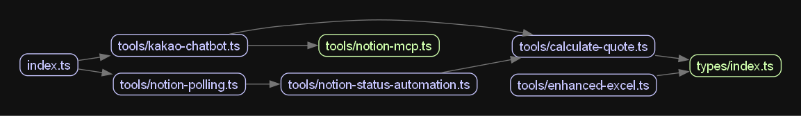

# 의존성 분석 결과

## 생성일: 2024-XX-XX

### 의존성 그래프

### 주요 발견사항
1. **kakao-chatbot.ts가 중심 허브**
   - 대부분의 모듈이 이 파일에 의존
   - 너무 많은 책임을 가지고 있음

2. **순환 의존성**
   - [여기에 발견된 순환 의존성 기록]

3. **개선 필요 영역**
   - kakao-chatbot.ts 분리 필요
   - 계층 구조 명확화 필요

### 파일별 의존성 수
- kakao-chatbot.ts: X개
- notion-mcp.ts: X개
- calculate-quote.ts: X개